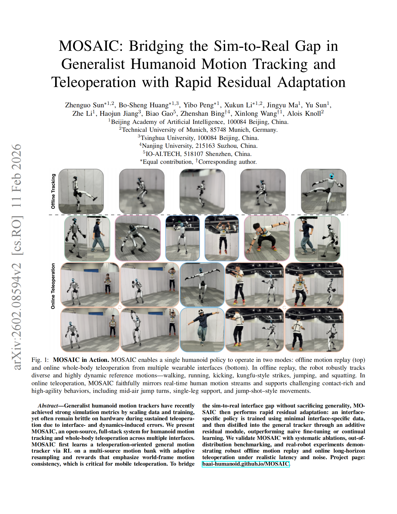

---
# Leave the homepage title empty to use the site title
title: ""
date: 2022-10-24
type: landing

design:
  # Default section spacing
  spacing: "6rem"

sections:
  - block: resume-biography-3
    content:
      # Choose a user profile to display (a folder name within `content/authors/`)
      username: admin
      text: ""
      # Show a call-to-action button under your biography? (optional)
      button:
        text: Download CV
        url: uploads/XuKun_Li_CV.pdf
    design:
      css_class: dark
      background:
        color: black
        image:
          # Add your image background to `assets/media/`.
          filename: backgrounds/stacked-peaks.svg
          filters:
            brightness: 1.0
          size: cover
          position: center
          parallax: false
  - block: markdown
    content:
      title: '📰 News'
      subtitle: ''
      text: |-
        - **Feb 2026**: Released **DECO** on arXiv - a decoupled multimodal diffusion transformer for bimanual dexterous manipulation with tactile sensing. **Xukun Li**, Yu Sun, Lei Zhang, et al. [arXiv:2602.05513](https://arxiv.org/abs/2602.05513)
        - **Feb 2026**: Released **MOSAIC** on arXiv - a full-stack system for humanoid motion tracking and teleoperation. Bo-Sheng Huang*, Yibo Peng*, **Xukun Li***, et al. (*Equal contribution) [arXiv:2602.08594](https://arxiv.org/abs/2602.08594)
    design:
      columns: '1'
  - block: markdown
    id: papers
    content:
      title: Selected Publications
      subtitle: '(*: Equal contribution, †: Corresponding author)'
      text: |-
        

          

            

              
            

            

              <h3 class="text-lg font-semibold mb-1">
                <a href="publication/deco/" class="hover:text-primary-600 dark:hover:text-primary-400 transition-colors">
                  DECO: Decoupled Multimodal Diffusion Transformer for Bimanual Dexterous Manipulation with a Plugin Tactile Adapter
                </a>
              </h3>
              

                <strong>Xukun Li</strong>, Yu Sun, Lei Zhang, Bosheng Huang, Yibo Peng, Yuan Meng, Haojun Jiang, Shaoxuan Xie, Guocai Yao, Alois Knoll, Zhenshan Bing, Xinlong Wang, Zhenguo Sun
              

              

                <em>arXiv preprint</em>, 2026
              

              

                A decoupled multimodal diffusion transformer for bimanual manipulation with a lightweight tactile adapter.
              

              

                <a href="https://arxiv.org/pdf/2602.05513" target="_blank" rel="noopener" class="inline-flex items-center px-3 py-1.5 text-sm font-semibold rounded-full border-2 border-red-500 text-red-600 hover:bg-red-500 hover:text-white dark:border-red-400 dark:text-red-400 dark:hover:bg-red-500 dark:hover:text-white transition-colors no-underline">
                  <i class="fas fa-file-pdf mr-1.5"></i>PDF</a>
                <a href="https://arxiv.org/abs/2602.05513" target="_blank" rel="noopener" class="inline-flex items-center px-3 py-1.5 text-sm font-semibold rounded-full border-2 border-orange-500 text-orange-600 hover:bg-orange-500 hover:text-white dark:border-orange-400 dark:text-orange-400 dark:hover:bg-orange-500 dark:hover:text-white transition-colors no-underline">
                  <i class="ai ai-arxiv mr-1.5"></i>arXiv</a>
                <a href="https://baai-humanoid.github.io/DECO-webpage/" target="_blank" rel="noopener" class="inline-flex items-center px-3 py-1.5 text-sm font-semibold rounded-full border-2 border-green-500 text-green-600 hover:bg-green-500 hover:text-white dark:border-green-400 dark:text-green-400 dark:hover:bg-green-500 dark:hover:text-white transition-colors no-underline">
                  <i class="fas fa-globe mr-1.5"></i>Project</a>
              

            

          

        

        

          

            

              
            

            

              <h3 class="text-lg font-semibold mb-1">
                <a href="publication/mosaic/" class="hover:text-primary-600 dark:hover:text-primary-400 transition-colors">
                  MOSAIC: Bridging the Sim-to-Real Gap in Generalist Humanoid Motion Tracking and Teleoperation with Rapid Residual Adaptation
                </a>
              </h3>
              

                Zhenguo Sun, Bo-Sheng Huang*, Yibo Peng*, <strong>Xukun Li*</strong>, Jingyu Ma, Yu Sun, Zhe Li, Haojun Jiang, Biao Gao, Zhenshan Bing†, Xinlong Wang†, Alois Knoll
              

              

                <em>arXiv preprint</em>, 2026
              

              

                An open-source, full-stack system for humanoid motion tracking and whole-body teleoperation with rapid residual adaptation.
              

              

                <a href="https://arxiv.org/pdf/2602.08594" target="_blank" rel="noopener" class="inline-flex items-center px-3 py-1.5 text-sm font-semibold rounded-full border-2 border-red-500 text-red-600 hover:bg-red-500 hover:text-white dark:border-red-400 dark:text-red-400 dark:hover:bg-red-500 dark:hover:text-white transition-colors no-underline">
                  <i class="fas fa-file-pdf mr-1.5"></i>PDF</a>
                <a href="https://arxiv.org/abs/2602.08594" target="_blank" rel="noopener" class="inline-flex items-center px-3 py-1.5 text-sm font-semibold rounded-full border-2 border-orange-500 text-orange-600 hover:bg-orange-500 hover:text-white dark:border-orange-400 dark:text-orange-400 dark:hover:bg-orange-500 dark:hover:text-white transition-colors no-underline">
                  <i class="ai ai-arxiv mr-1.5"></i>arXiv</a>
                <a href="https://baai-humanoid.github.io/MOSAIC/" target="_blank" rel="noopener" class="inline-flex items-center px-3 py-1.5 text-sm font-semibold rounded-full border-2 border-green-500 text-green-600 hover:bg-green-500 hover:text-white dark:border-green-400 dark:text-green-400 dark:hover:bg-green-500 dark:hover:text-white transition-colors no-underline">
                  <i class="fas fa-globe mr-1.5"></i>Project</a>
              

            

          

        

    design:
      columns: '1'
---
