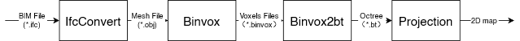
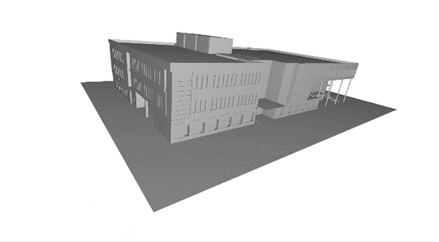
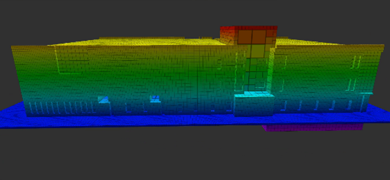
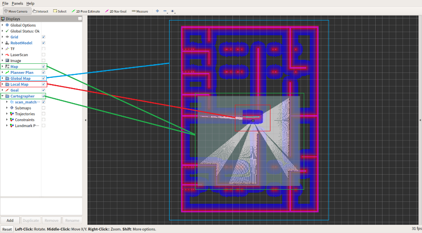
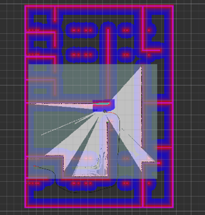

## 概述
本研究在2D同步定位与地图构建(SLAM)中使用建筑信息模型(BIM)信息。在这个项目中，机器人使用BIM中的信息生成2D地图作为建筑物的先验知识。然后移动机器人使用这个全局地图进行初始定位和路径规划，可以是用于地图更新的覆盖路径，也可以是到目标位置的路径。此外，移动机器人可以根据后续探索更新这个先验地图。总的来说，这种方法的优势在于它可以帮助机器人在不需要先生成地图的情况下到达目标位置。相反，机器人可以基于先验知识到达期望位置，并在移动过程中更新地图。

本项目使用的SLAM方法基于Cartographer，并在Gazebo中通过添加随机障碍物进行仿真测试。所有工作均由本人独立完成。

## 摘要
建筑机器人除非事先通过SLAM构建地图（这是耗时的，且阻碍了建筑机器人制定全局任务计划），否则无法获得建筑物的全局信息。同时，建筑信息模型（BIM）是建筑信息的数字化和标准化。有了BIM，建筑场景中的建筑内部实际上是半未知的，而不是完全未知的。在本研究中，我们提出了一个将BIM转换为2D理想地图的流程。然后，我们将2D理想地图和SLAM结合用于机器人导航。通过使用这个理想的2D地图作为机器人的初始全局地图，机器人可以获得建筑物内部的全局信息，从而节省时间并提高效率。

## 流程
此图显示了数据转换的流程。

此图显示了obj格式的建筑物。

此图显示了八叉树形式的建筑物。

## 仿真
此图显示了SLAM中的不同地图。

如图所示，尽管我们的机器人对环境是陌生的，但根据由2D理想地图通过分层代价地图结构生成的全局代价地图，它已经拥有了建筑物的全局信息。
最大的框显示全局代价地图，第二大的框显示传感器的信息。最小的框显示局部代价地图。

此图显示即使传感器在目标点周围没有任何信息，机器人也能生成到目标的正确路径。

此图显示机器人可以根据局部代价地图改变其局部路径，以避免与障碍物发生碰撞。

此图显示机器人可以到达建筑物特定楼层的任意目标点。

## 结论
在本文中，我们提出了一个将BIM转换为2D理想地图的流程，然后我们使用2D理想地图进行机器人导航，从而在建筑场景中节省了通过SLAM构建地图的时间。未来，我们将尝试使用BIM中更多的语义信息和生命周期信息来帮助机器人完成任务。

<!--more-->
